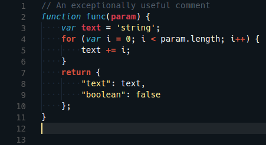

Glacier is a flat, colorful theme for Visual Studio Code. It focuses on using saturated colors to introduce more contrast and visual interest compared to other flat approaches.

## Backlog

Here is a list of upstream issues that would improve this theme and/or make it more consistent with [upstream](https://github.com/shovelandsandbox/glacier-theme):

- [[themes] Themes don't support background styling](https://github.com/Microsoft/vscode/issues/3429)
- [tmTheme selectionForeground is not supported](https://github.com/Microsoft/vscode/issues/10622) (see https://github.com/Tyriar/vscode-theme-glacier/commit/6493aff129af2680bec21e33371a9d4d7eebc2d0)
- [tmTheme bold fontStyle is not supported](https://github.com/Microsoft/vscode/issues/10623)
- [Indent guides should use `guides` setting from tmTheme, not `invisibles`](https://github.com/Microsoft/vscode/issues/10624) (see https://github.com/Tyriar/vscode-theme-glacier/commit/487ed9bbcc8ae77ff796e96d5bd8c28229d5ff80)
- [Entire function is scoped as .token.function.meta.js](https://github.com/Microsoft/TypeScript-TmLanguage/issues/208#issuecomment-240530117) (see https://github.com/Tyriar/vscode-theme-glacier/issues/1)

## Credits

Glacier was originally developed by [Joey Figaro](https://github.com/joeyfigaro) at [shovelandsandbox/glacier-theme](https://github.com/shovelandsandbox/glacier-theme) for Sublime Text.
